# Portafolio de Análisis de Datos 📉📊📈

¡Bienvenido a mi portafolio de análisis de datos en GitHub! En este repositorio, encontrarás una colección de mis proyectos principales de análisis de datos, así como capturas de pantalla de los dashboards que he creado.

## Proyectos Principales 🚀

### Proyecto 8: [Mercaderismo Florida](https://app.powerbi.com/view?r=eyJrIjoiY2U5NTgzZGQtMjZlZS00M2Y3LTg2M2MtMTRhY2Q4YWVkNGI4IiwidCI6IjYyNDg5MGMwLTA2ZTEtNDA5OC1hY2ZhLTA3YzFkYWUyYzcxNCIsImMiOjR9)

Este proyecto consistió en el análsis de datos que se relevó en la campaña de mercaderismo tradicional que se realizó con una marca reconocida en Perú de atunes.

**Tecnología usada:**

- Se utilizó ``Power Apps`` para la recolección de información.
- Se utilizó ``Pipelines ETL`` para la trasnformación y carga a una base de datos de ``PostgreSQL`` para luego analizarlo con ``Power BI``.

**Dashboard:**

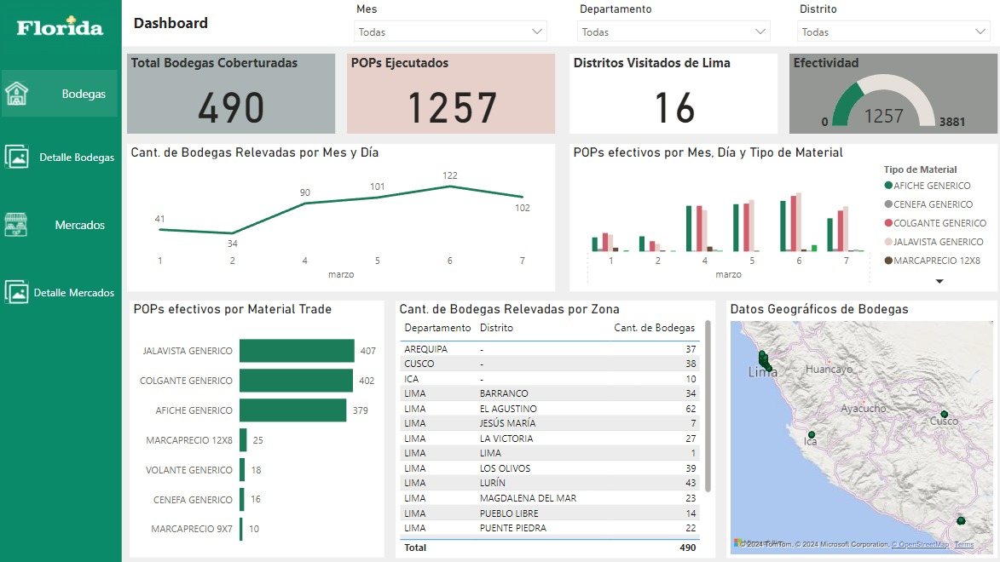

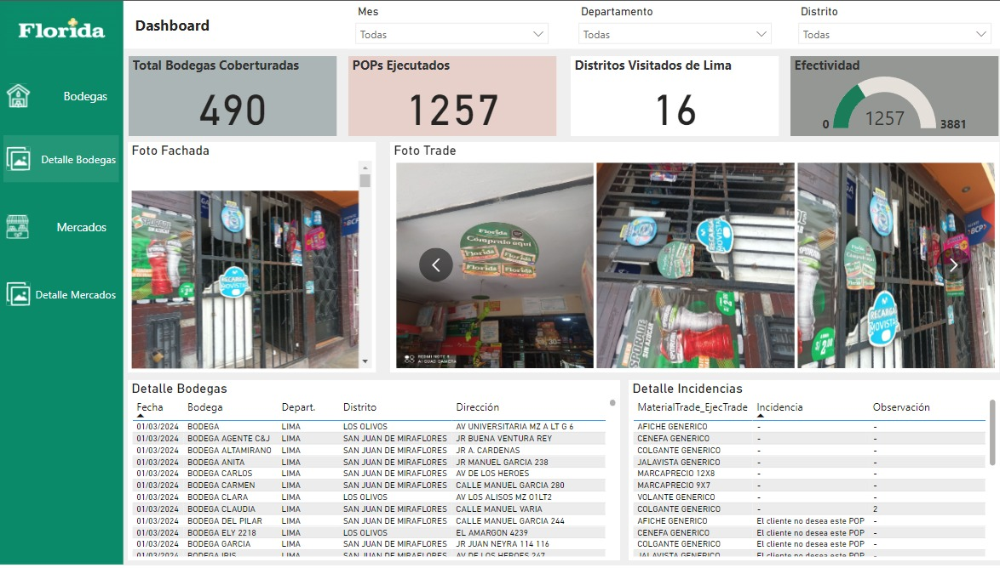

### Proyecto 7: [Análisis de Estrategia Publicitaria para  una Operadora de Comunicaciones](https://app.powerbi.com/view?r=eyJrIjoiY2ZlYjZlN2MtOWNiNS00NDFmLWE0OTUtZjFjZmQ1MzNhYjJjIiwidCI6IjYyNDg5MGMwLTA2ZTEtNDA5OC1hY2ZhLTA3YzFkYWUyYzcxNCIsImMiOjR9)

En este projecto se refleja el impacto obtenido a las estrategia publicitaria realizada en toda la región, contiene métricas y KPIs que ayudan a la toma de decisiones, como porcentaje de cobertura, clientes recuperados, estadística de los resultados de la encuesta, y como afecto el mercaderismo a los nuevos clientes de esta operadora.

**Tecnología usada:**

- En este projecto se utilizó una arquitectura de datos para poder manejar la gran catindad de información ya que también se requería un reporte fotográfico de más de 2 millones de fotos.
- Se utilizó ``Power Apps`` para la recolección de información.
- Para el almacenamiento se realizó un modelamiento OLTP de listas en ``SharePoint``
- Para la transformación de datos, se creó un ``pipelines ETL para el procesamiento de datos`` y otro para disminuir el peso a menos de 90 kb cada foto.
- Se realizó un m``odelamiento OLAP y usé PostgreSQL como data warehousing``.
- Para el dashboard y el análisis de los datos se realizó en ``Power BI``

**Dashboard:**

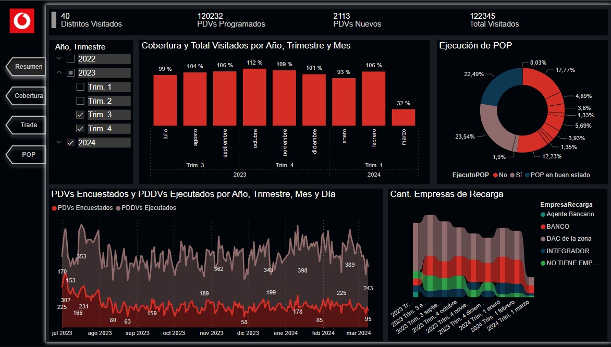

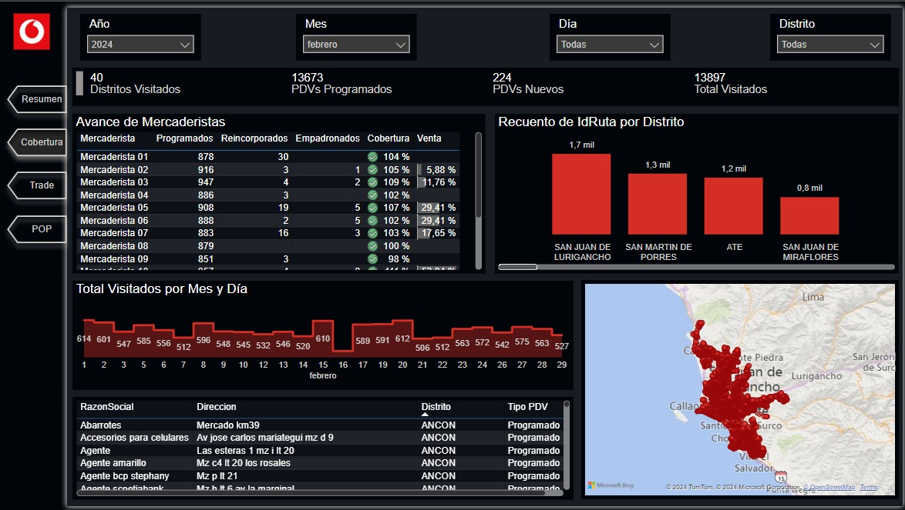

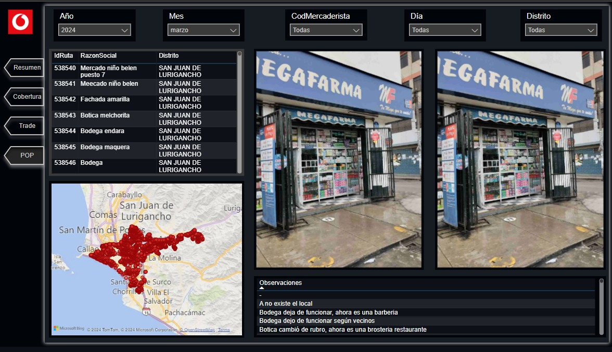

### Proyecto 6: [Mercaderismo Moderno Las Noras](https://app.powerbi.com/view?r=eyJrIjoiZWI5MDgxOTctOWMwOS00YjRjLTgzODctMGEyMzg0MzhjYzZjIiwidCI6IjYyNDg5MGMwLTA2ZTEtNDA5OC1hY2ZhLTA3YzFkYWUyYzcxNCIsImMiOjR9)

Este dashboard presenta un análisis de Business Intelligence para una marca Argentina de Carnes del stock de almacén, la disposición en góndola y la evolución de precios según el supermercado. Además, alerta sobre los quiebres de stock para enfocar mayor atención en estos productos.

**Tecnología usada:**

- Se utilizó `JorForm` para la recolección de información.
- Para el análisis y transformación de datos se utilizó un `pipeline ETL con Python` almacenandose en un excel debido a que la información no pasaba de las 50 mil filas en excel.
- Para la elaboración del dashboard se usó `Power BI`.

**Dashboard:**

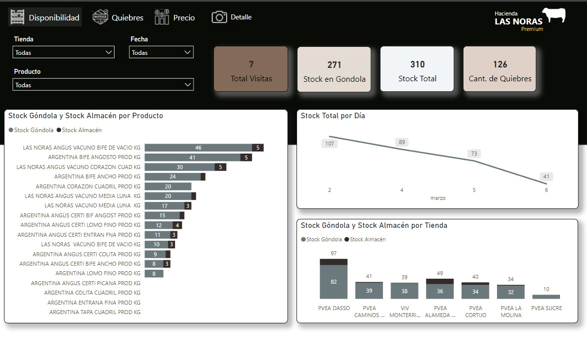

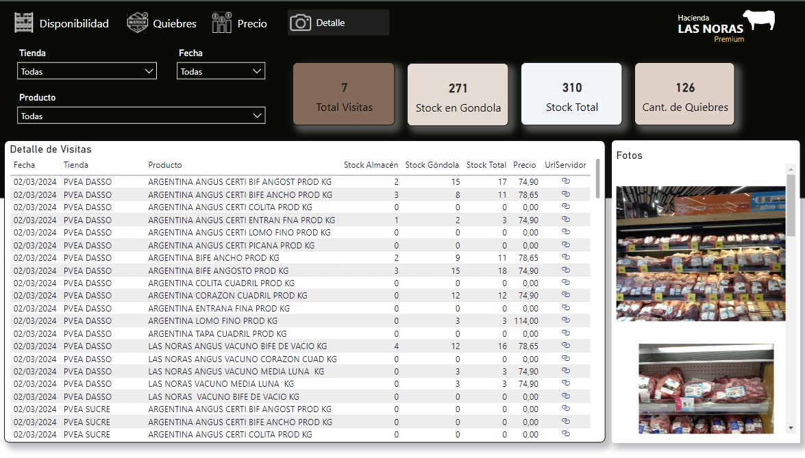

### Proyecto 5: [Impulso y Encuesta Versatie](https://app.powerbi.com/view?r=eyJrIjoiYTc0MDdkMDUtNjA5YS00ODE3LWI2NWEtOTgxMTgwNGI0YzZhIiwidCI6IjYyNDg5MGMwLTA2ZTEtNDA5OC1hY2ZhLTA3YzFkYWUyYzcxNCIsImMiOjR9)

Versatié es un producto de crema de leche de la marca Rich. Aquí se realizó un análisis del impacto que tuvo el impulso en diferentes supermercados de Perú. El diseño de este dashboard se dividió en tres pestañas: una de resumen general, otra de impulso y la tercera de encuestas. En esta última se muestra de manera amigable la evolución que tuvieron las ventas con respecto al abordaje, así como el papel influyente de las encuestas en la conversión de personas que solamente miraban los productos en compradores.

**Tecnología usada:**

- Se utilizó `Google Form` para la recolección de información.
- Para el análisis y transformación de datos se utilizó `Excel`.
- Para la elaboración del dashboard se usó `Power BI`.

**Dashboard:**

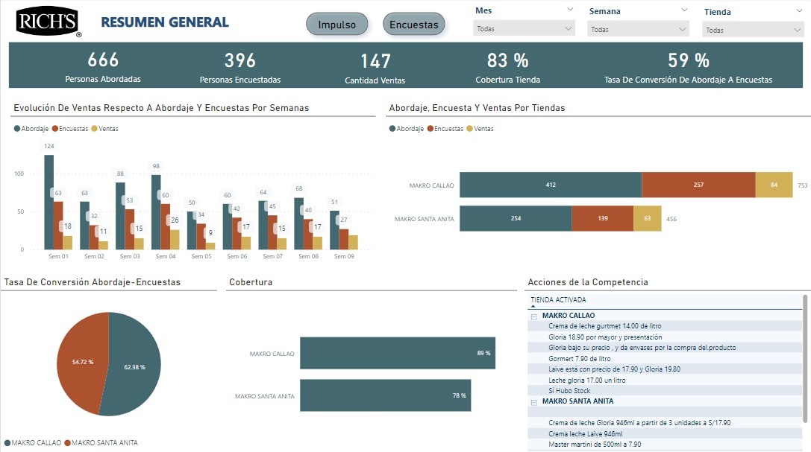

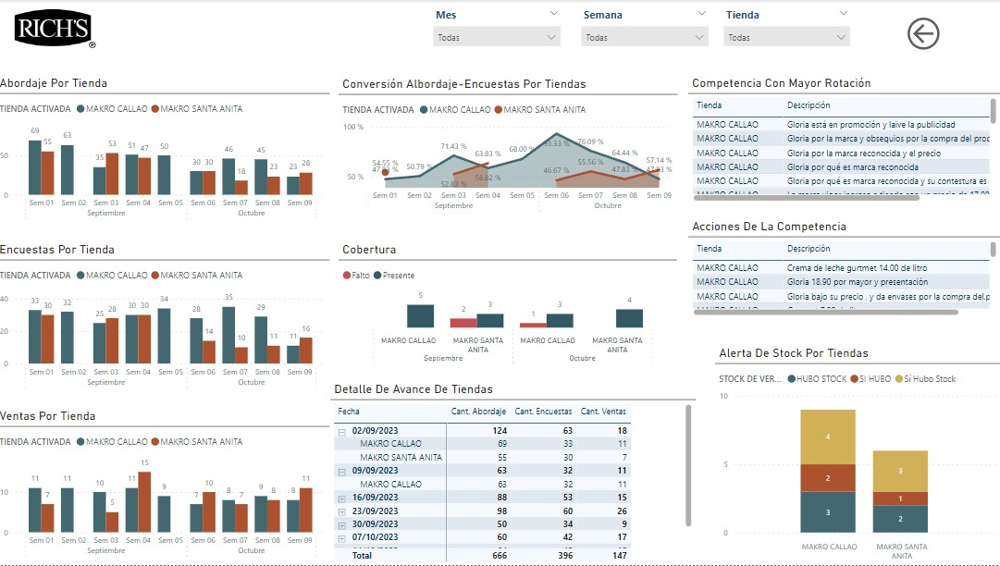

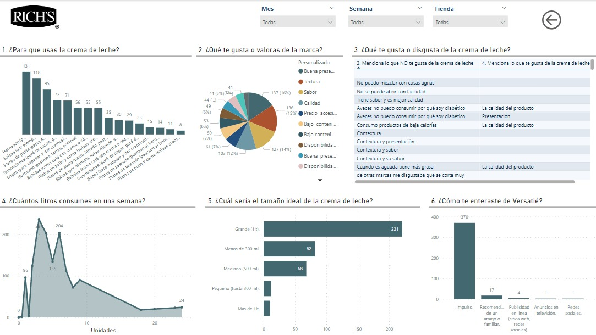

### Proyecto 4: [Impulso Ajinomoto](https://app.fabric.microsoft.com/view?r=eyJrIjoiMjVhNTZiMTAtODRlMy00OGQ1LTk2NjItYTEzOGI2YjU4NzIyIiwidCI6IjYyNDg5MGMwLTA2ZTEtNDA5OC1hY2ZhLTA3YzFkYWUyYzcxNCIsImMiOjR9)

En este proyecto se realizó un análisis de business intelligence sobre el impacto que tuvo esta campaña de impulso durante 4 semanas, incluyendo un análisis de stock, quiebres y ventas.

**Tecnología usada:**

- Se utilizó `JotForm` para la recolección de información.
- Para el análisis y transformación de datos se utilizó `Excel`.
- Para la elaboración del dashboard se usó `Power BI`.

**Dashboard:**

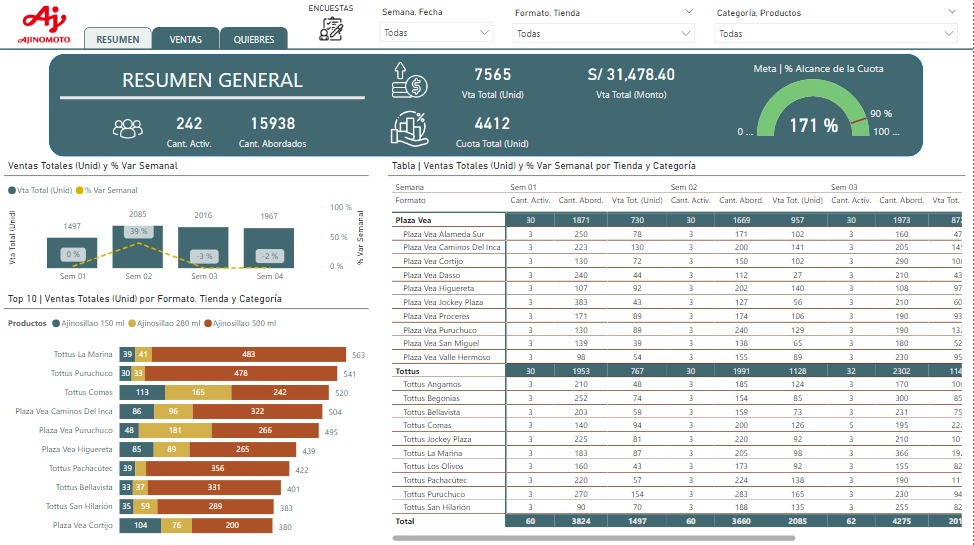

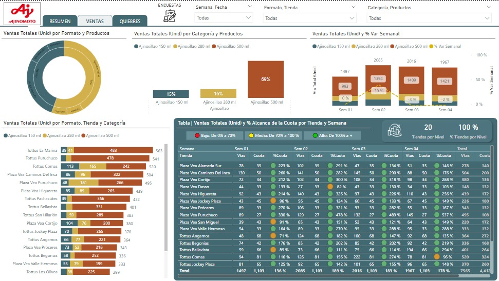

### Proyecto 3: Proyectos personales

Aca muestro dos proyectos personales de Ventas, que muestra el potencial que tiene Power BI

**Dashboard:**

### Proyecto 2: Analítica de datos en Excel

En este pequeño projecto se demuestra como se puede realizar dashboard y análisis de datos con excel.

**Dashboard:**

### Proyecto 1: Prueba de Ingreso

Este es un examen de analítica de datos de una empresa, lo coloco ya que puede servir de apoyo a personas que desean desarrollarse en el mundo de los datos.

**Dashboard:**

## Contacto

¡Gracias por visitar mi portafolio de análisis de datos! Si tienes alguna pregunta o estás interesado en colaborar, no dudes en ponerte en contacto conmigo:

- Correo Electrónico: [gianmarco0101@gmail.com](mailto:gianmarco0101@gmail.com)
- LinkedIn: [Gianmarco Holm](https://www.linkedin.com/in/gianmarco-holm/)
